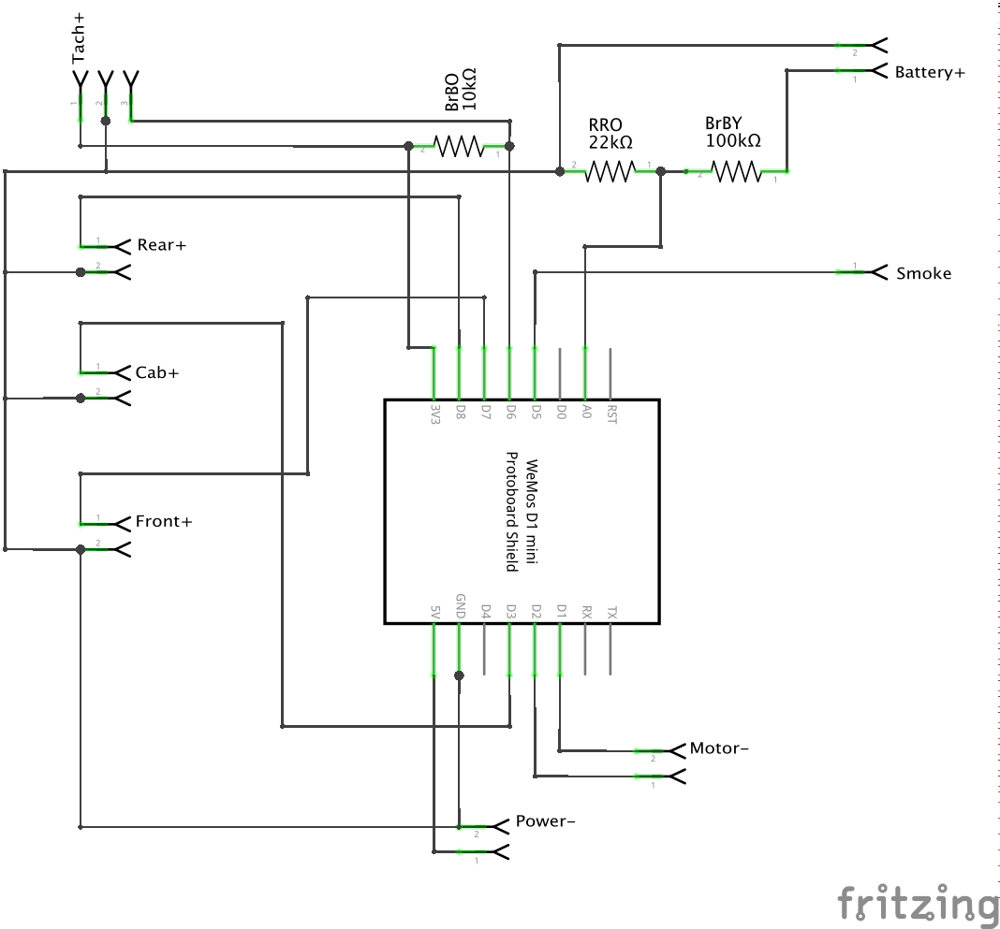
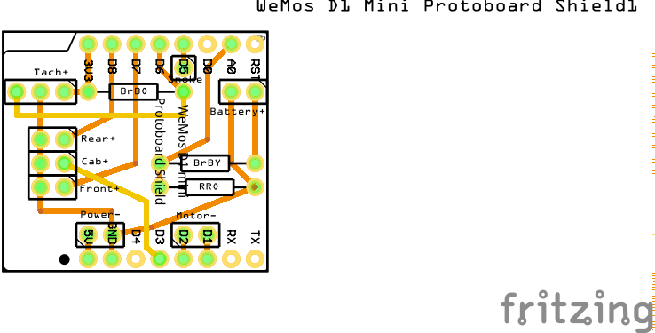
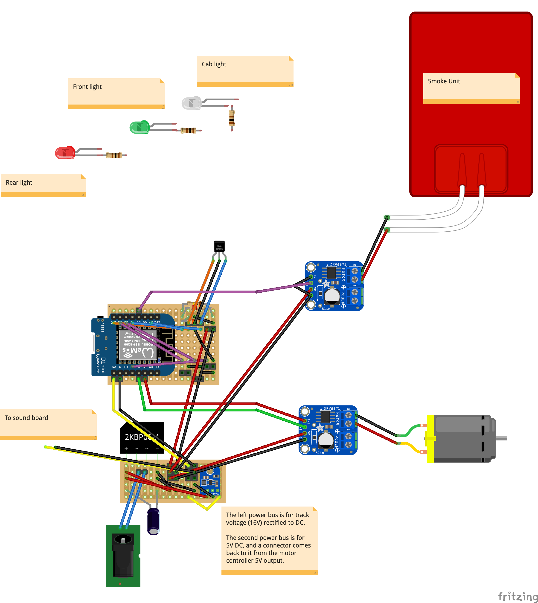

# Engine Microcontroller

The engine microcontroller controls:
- Motor power
- Smoke power
- Lights
- Tachometer
- Running the locomotive simulation

---

## Firmware
The firmware is in the /LocoEngine folder of this repo.

---

## Fritzing File
[Fritzing file](EngineHat.fzz)

---

## Schematic

---

## PCB Hat

---

## Breadboard

In the actual locomotives, I use the PCB hat, but this breadboard diagram is useful for showing the external wiring and connections.  (Such as to the motor drivers.)

