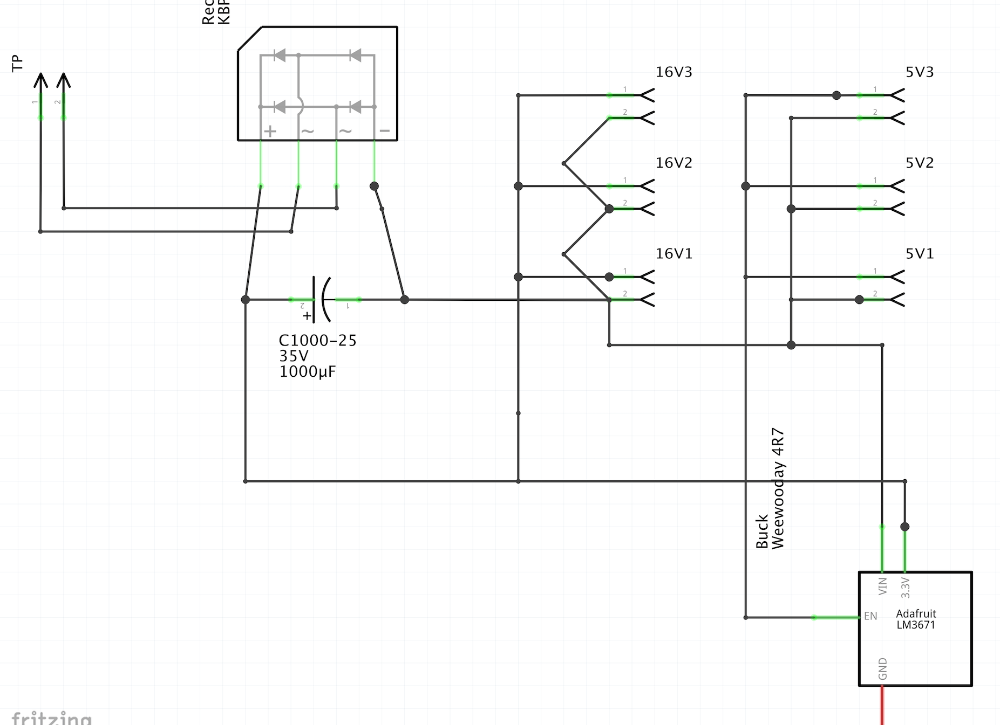
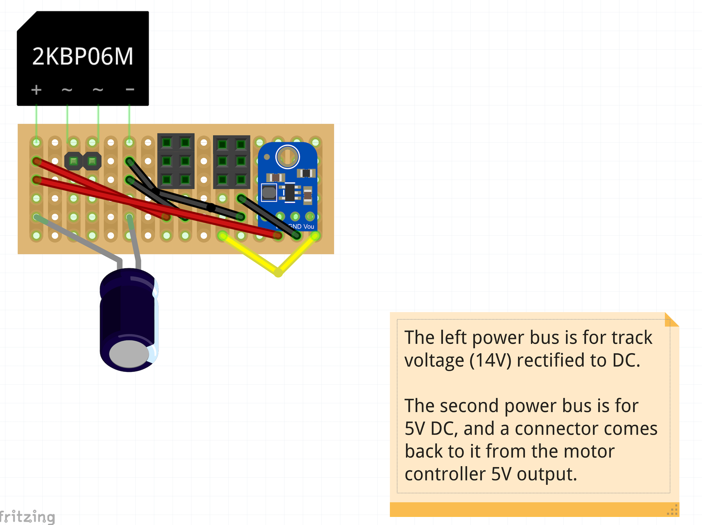
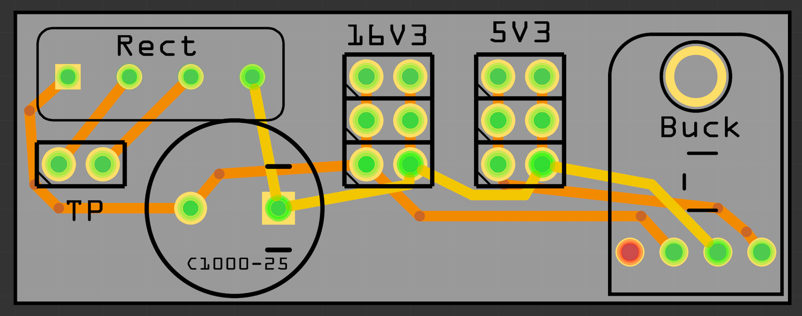

# Power Supply

This board takes track power (~16V AC) as input.  It then:
- Rectifies to DC
- Smooths the waveform
- Provides 16V DC output
- Provides 5V DC output

---

## Fritzing File

[Fritzing file](PowerSupply.fzz)

---

## Schematic

Note: The pim labels on the buck converter in the lower-right are wrong.  Ignore them and wire up as shown in the PCB and Breadboard diagrams.

---

## Breadboard

---

## PCB

