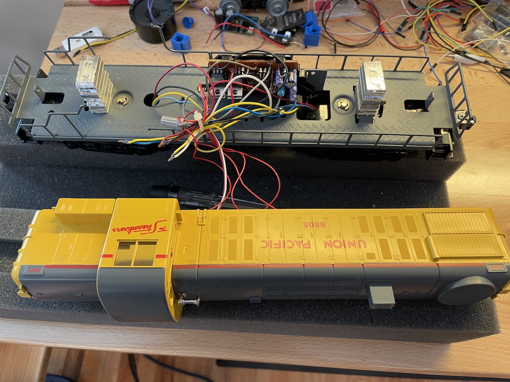
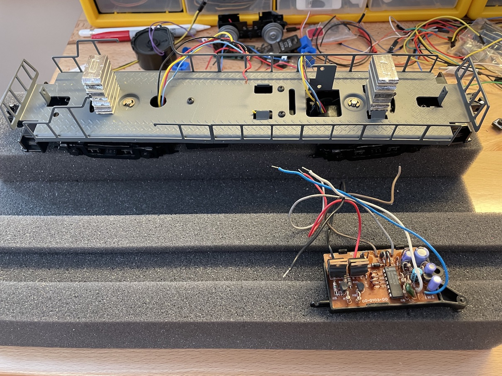
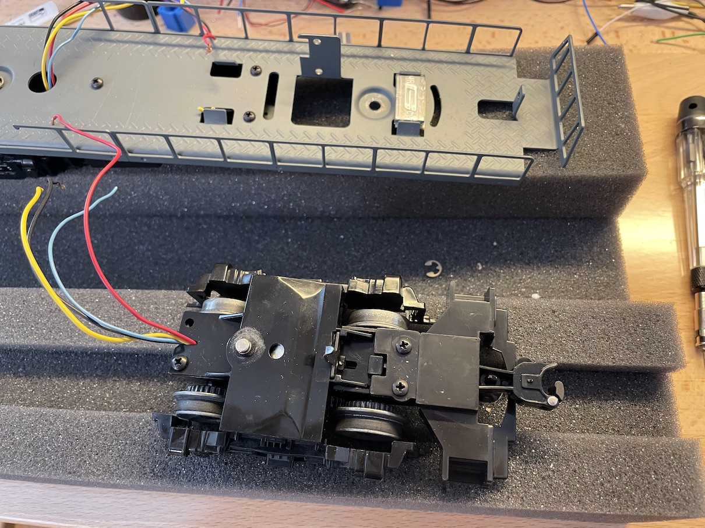

## Remove the Shell

---

## Cut wires and remove old E-Unit

Try to save as much wire as possible coming from the trucks, but don't worry about anything else.

This locomotive had weights stacked, creating a high center-of-gravity.  I'm going to remove them and put weights down lower.

---

## Remove truck that will get the tachometer

Here I'm removing the front truck.  The opening for the wires is wider, which we'll need since we're adding extra wires for the tach.  We don't want it to resist turning.

---

## Wire/Glue/Test the tachometer

For this step, see [TachCalibrator Instructions](../TachCalibrator/README.md).

---