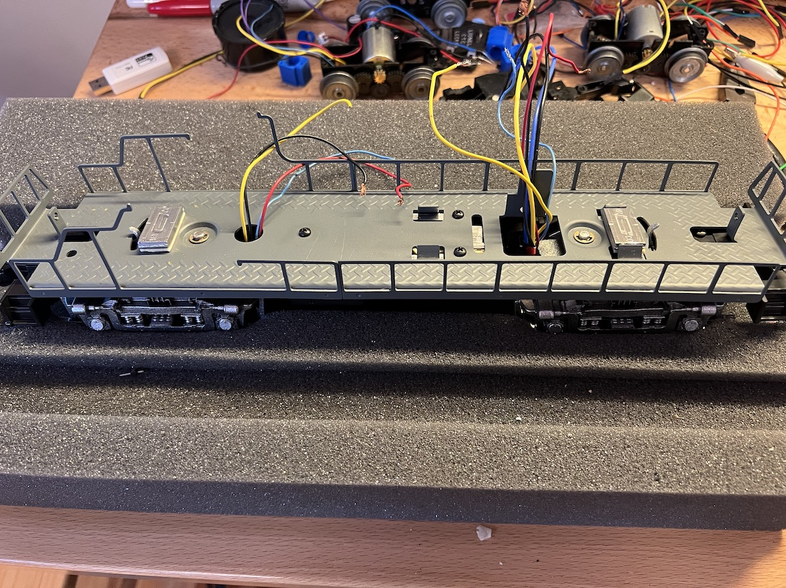
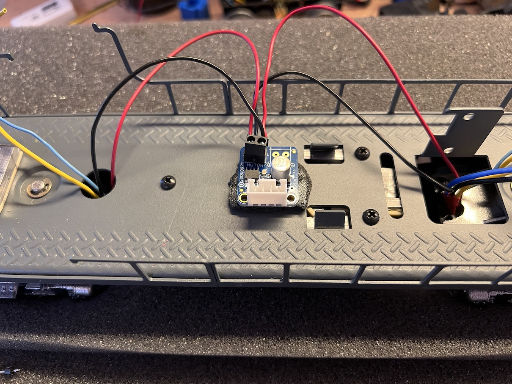
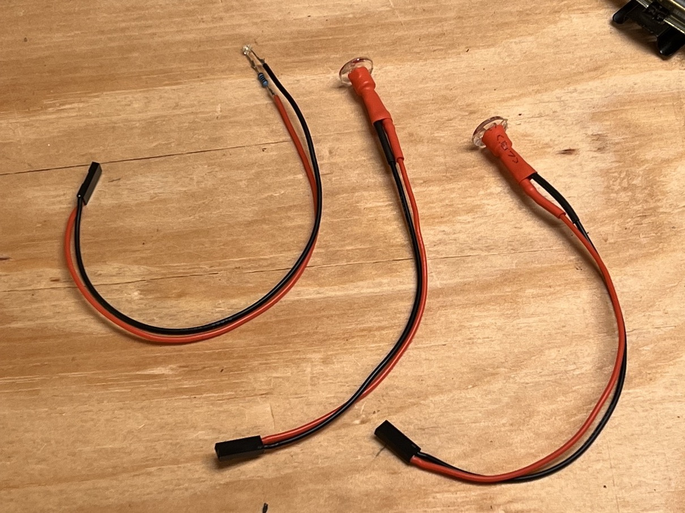
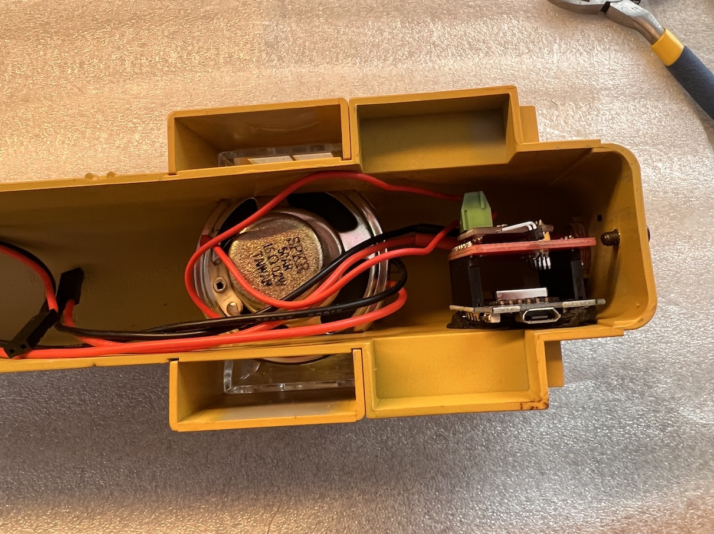

## Remove the Shell

---

## Cut wires and remove old E-Unit

Try to save as much wire as possible coming from the trucks, but don't worry about anything else.

This locomotive had weights stacked, creating a high center-of-gravity.  I'm going to relocate them down lower in the fuel tank.

---

## Remove truck that will get the tachometer

Here I'm removing the front truck.  The opening for the wires is wider, which we'll need since we're adding extra wires for the tach.  We don't want it to resist turning.

---

## Wire/Glue/Test the tachometer

For this step, see [TachCalibrator Instructions](../TachCalibrator/README.md).

---

## Reinstall trucks

Here I have painted the trucks, and reinstalled them.  I have also moved most of the weights down into the fuel tank.

---

## Power the motors

Install the motor driver and wire the truck motors to it.  Make sure to have lots of slack in these wires, because the trucks will turn.

---

## Prepare the LED lights

This Alco RS-3 has dual headlights and a cab light.  I convert them to LEDs, and use heatshrink wrap to clean up the packaging.

It's important to solder a resistor in series.  I use 100ohm for the cab light, and 47ohm for the headlights.

---

## Program the engine unit

1. Build and upload the engine firmware.

---

## Program and mount the sound unit

1. Build and upload the filesystem image.  It has the sound files.
2. Build and upload the sound firmware.
3. Test the sound.  You'll have both the engine and the sound ESP8266's still outside the chassis at this point.
4. Mount it in the body, with the usb port accessible.

---

