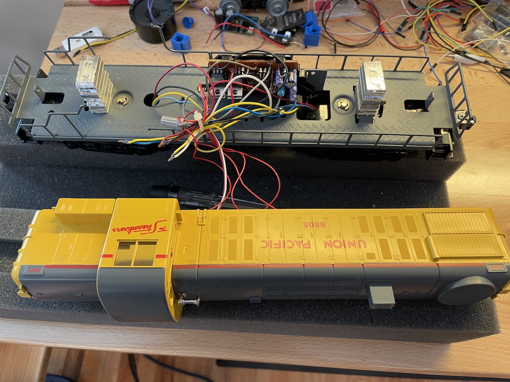
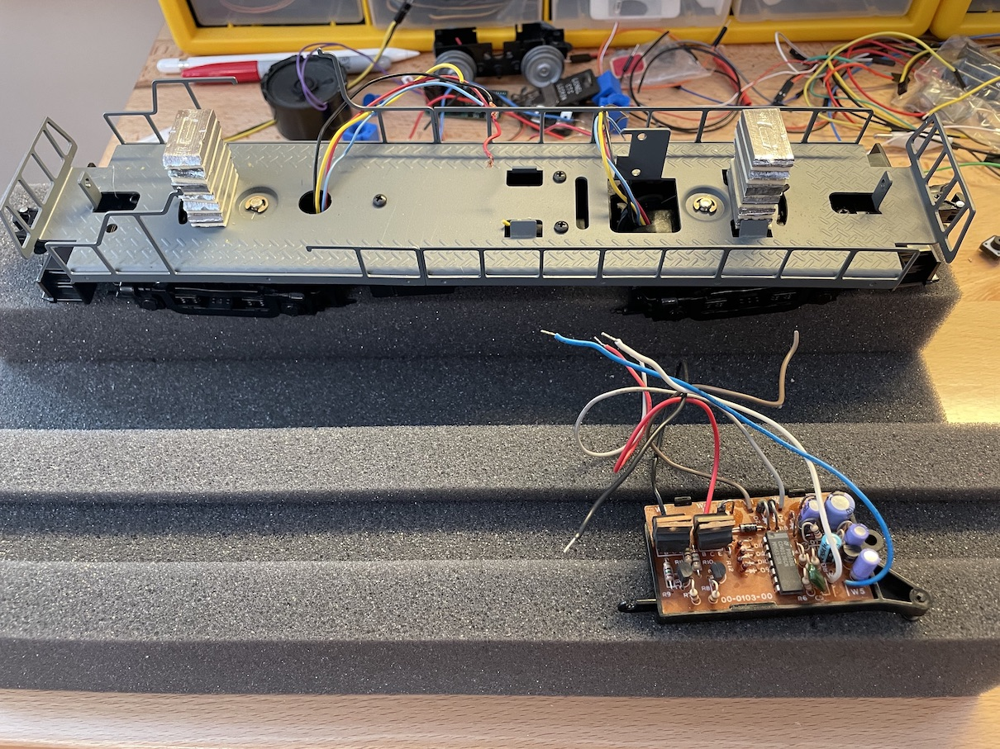
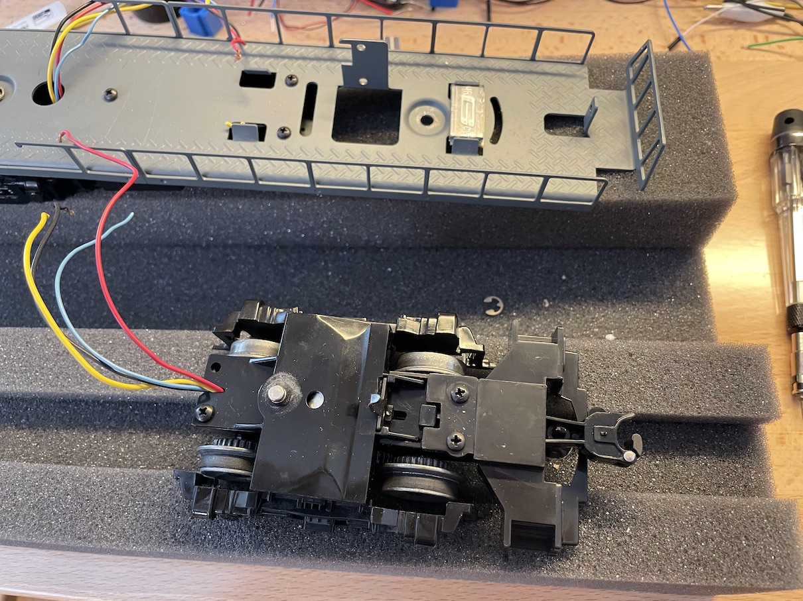
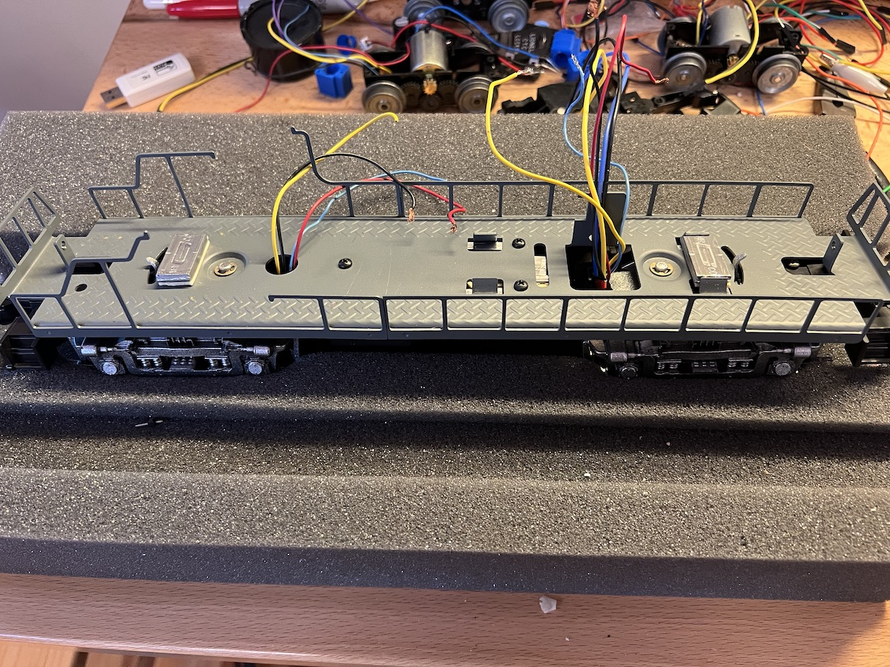
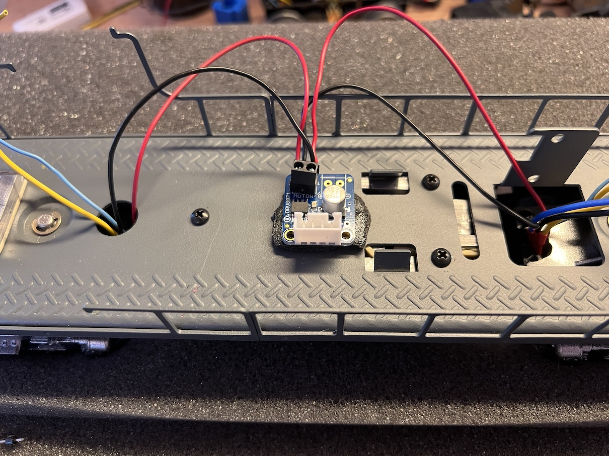
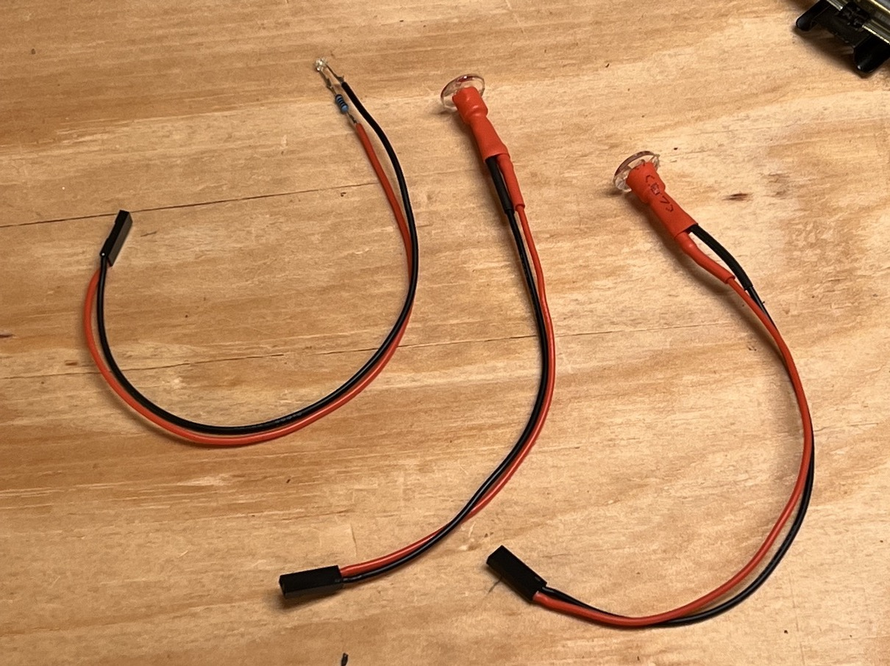
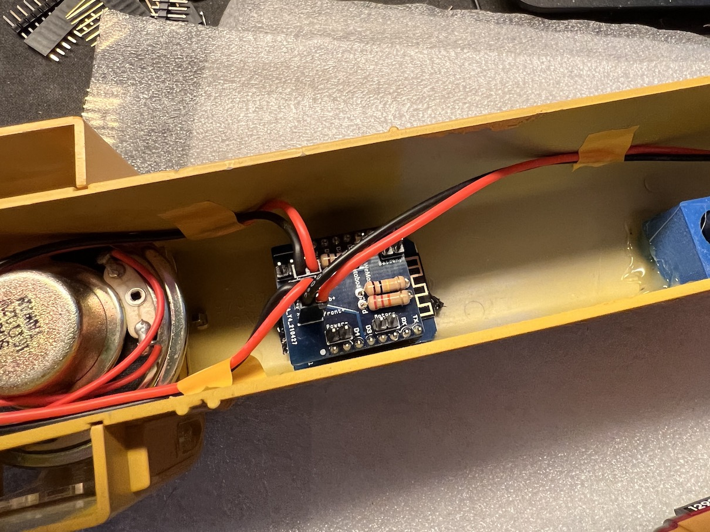
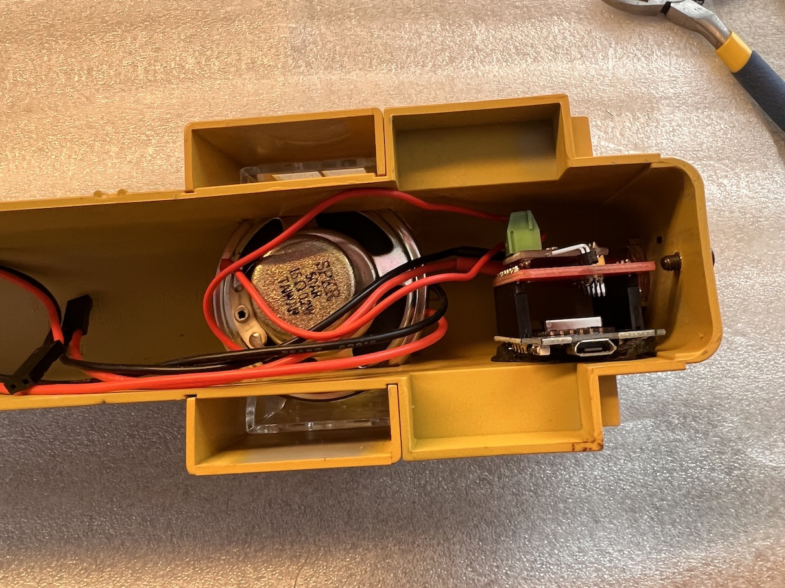
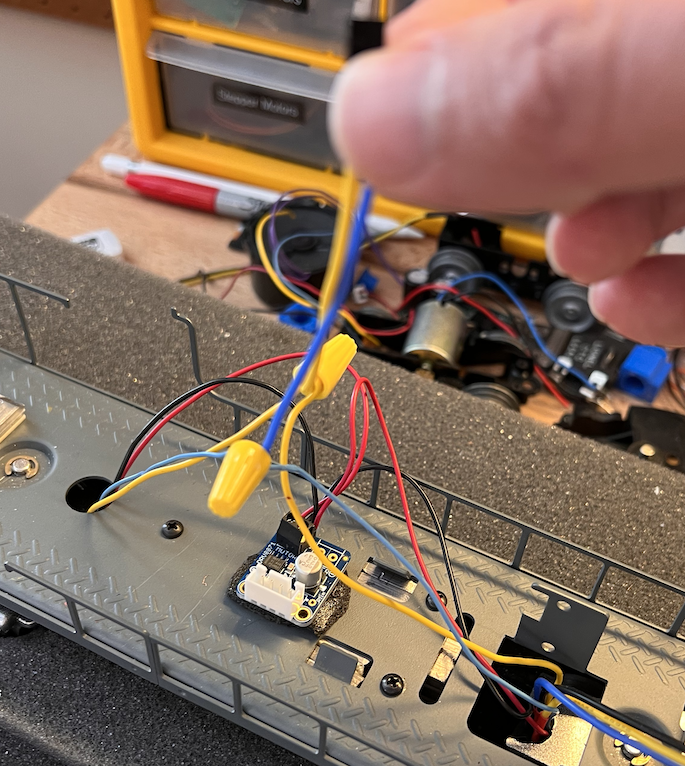

## Remove the Shell

This one has a conventional E-Unit.  No sound system.  Incandescent headlights and cab light.

---

## Cut wires and remove old E-Unit

Try to save as much wire as possible coming from the trucks, but don't worry about anything else.

This locomotive had weights stacked, creating a high center-of-gravity.  I'm going to relocate them down lower in the fuel tank.

---

## Remove truck that will get the tachometer

Here I'm removing the front truck.  The opening for the wires is wider, which we'll need since we're adding extra wires for the tach.  We don't want it to resist turning.

---

## Wire/Glue/Test the tachometer

For this step, see [TachCalibrator Instructions](../TachCalibrator/README.md).

---

## Reinstall trucks

Here I have painted the trucks, and reinstalled them.  I have also moved most of the weights down into the fuel tank.

---

## Power the motors

Install the motor driver and wire the truck motors to it.  Make sure to have lots of slack in these wires, because the trucks will turn and you don't want it to bind.

---

## Power the smokestack

The motor driver for the smokestack needs an extra jumper soldered in on the back, from pin 1 to pin 4.

TODO

---

## Prepare the LED lights

This Alco RS-3 has dual headlights and a cab light.  I convert them to LEDs, and use heatshrink wrap to clean up the packaging.

It's important to solder a resistor in series.  I use 100ohm for the cab light, and 47ohm for the headlights.

You can reinstall them right away.

---

## Assemble and program the engine microcontroller and hat

1. Assemble the Wemos D1 Mini and the Engine Hat.  The Engine Microcontroller is detailed [here](../EngineMicrocontroller/README.md).
2. Build and upload the engine firmware.

---

## Assemble and program the sound microcontroller and hat

1. Assemble the Wemos D1 Mini and the Sound Hat.  The Sound Hat is detailed [here](../SoundMicrocontroller/README.md).
1. Build and upload the filesystem image.  It has the sound files.
2. Build and upload the sound firmware.
3. Test the sound.  You'll have both the engine and the sound ESP8266's still outside the chassis at this point.
4. Mount it in the body, with the usb port accessible.

---

## Assemble the Power Supply PCB

The power supply is detailed [here](../PowerSupply/README.md).

---

** Get power from the trucks

Wire the truck power wires together and onto a Dupont connector that will go up to the power supply board.  Make sure to leave lots of slack.  The trucks will turn and you don't want it to bind.

I use twist connectors instead of soldered joints, because you might need to drop the trucks from the frame, while doing future maintenance.

---

