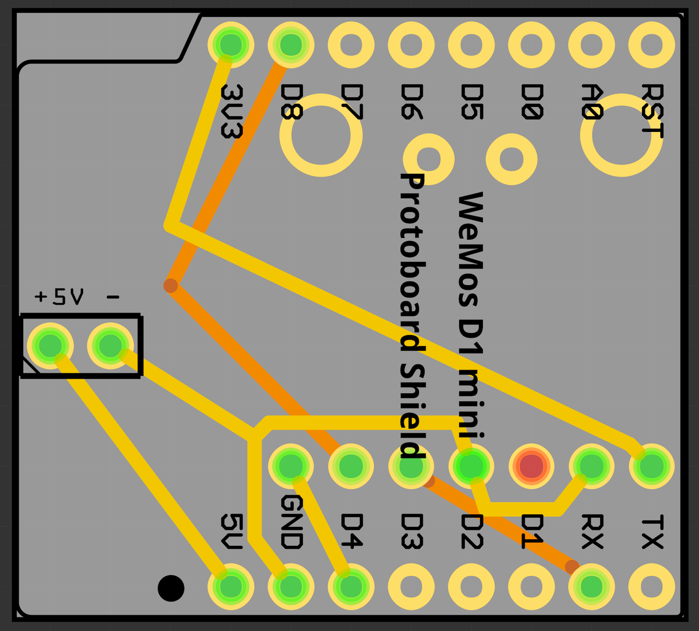
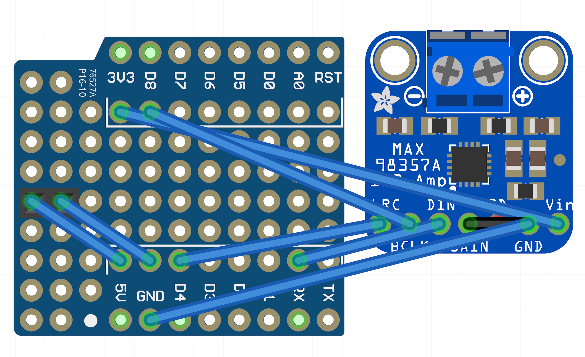
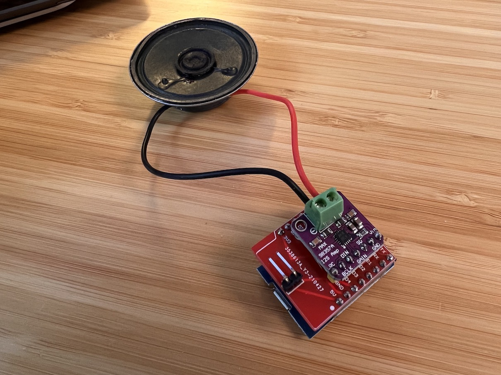

# Sound Microcontroller

The Sound Microcontroller listens for events from the Engine Microcontroller, and outputs synthesized sounds.

---

## Firmware
The firmware is in the /LocoSounds folder of this repo.

---

## Fritzing File
[Fritzing file](SoundHat.fzz)

---

## PCB

---

## Breadboard View
It's not actually assembled like this, but this picture helps explain the wiring.

---

## Assembled

