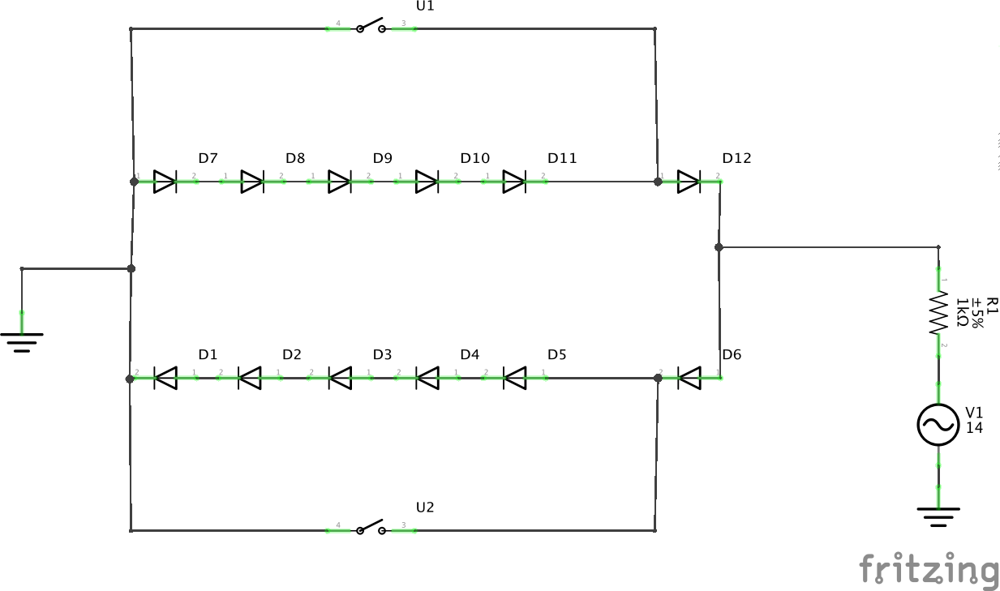
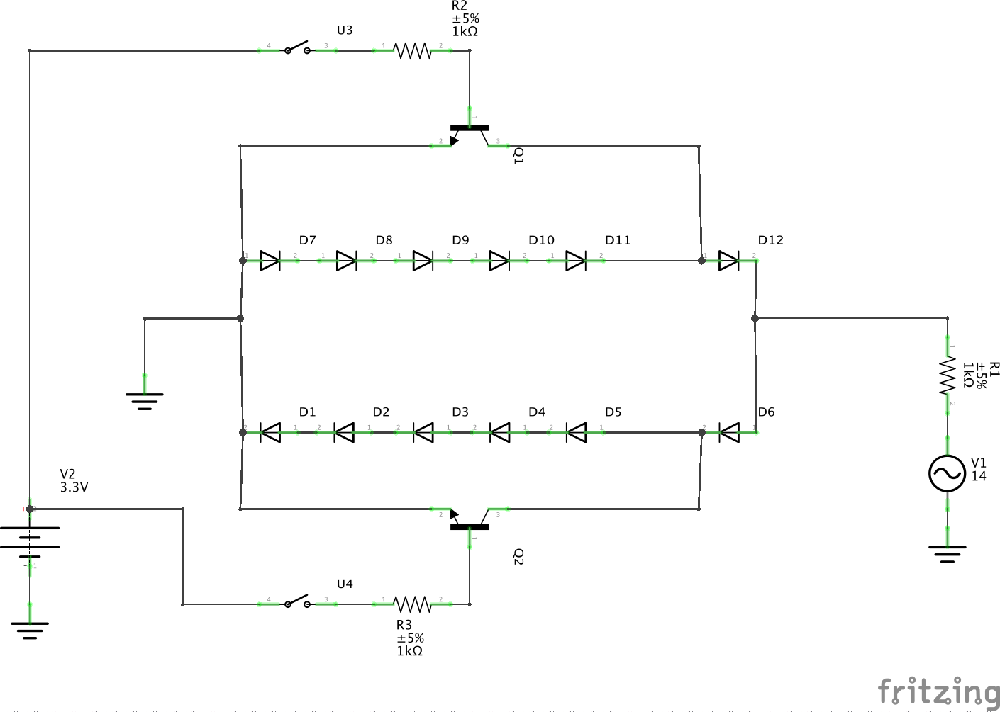

The whistle controller is a board that can be inserted in the ground path of an off-the-shelf conventional sound unit.  It listens for the same MQTT commands as the LocoSounds board, but instead of playing its own sounds, it controls the voltages going into a conventional sound unit, and lets that unit generate the sounds.

This means it can be used with Lionel TrainSounds, Williams TrueBlast, or others.

Here's the basic idea, borrowed from [this post](http://www.jcstudiosinc.com/Whistle-Button-Bell-Controller):

- The resistor on the right represents a conventional sound board, such as a Williams TrueBlast.
- Closing either switch will cause the AC sine wave to shift either positive or negative.  One direction sounds the horn.  One direction toggles the bell.
- I have built and tested a prototype of this.

The next step in developing the idea is that instead of physical switches, we want to use transistors, so that eventually we can control this from an ESP8266.

- These are NPN transistors.  The arrow side needs to be to ground, so this has to be "downstream" of the load.  Has to be on the ground side.
- R2 and R3 prevent a current rush from burning up the transistors.
- Switches U3 and U4 represent GPIO pins on the ESP8266 going to low or high.
- Note that I am trying to keep the grounds of the AC power and the DC microcontroller separate.  I'm not sure this is necessary, because eventually all grounds go together.  (The ESP8266 is powered by a rectifier circuit that comes from the AC.)  But it seemed like good practice to not create a bridge of ground from high-current AC that goes through the inside of my microcontroller.
- This is my next prototype to build.